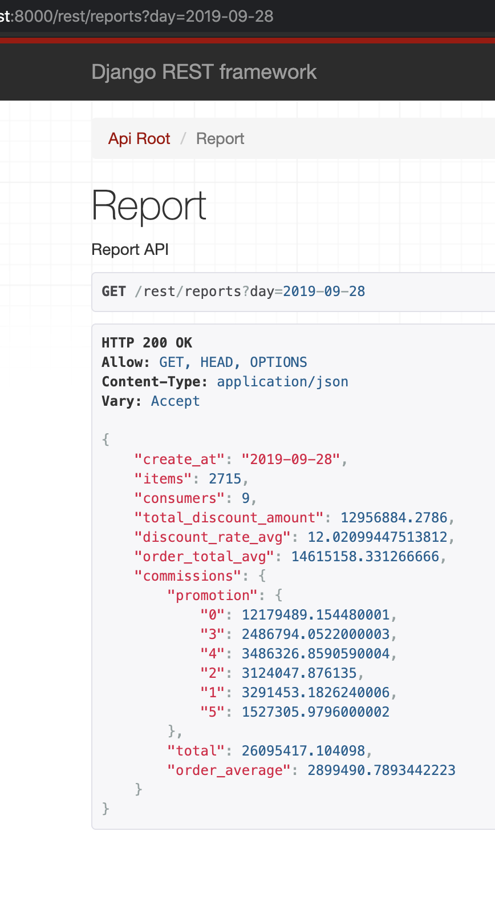

Django API backend for an eshop, this application was built in order to responds to a test.


## Installation
```
git clone git@github.com:asaidomar/suade_test.git
cd suade_test
export app_env=prod   # could also be 'test' or 'local'
docker-compose up
```
## Load test data
Once the application is started
```
docker exec -it app.local python manage.py load_data
```

## Run tests
```
export app_env=test
docker-compose up
docker exec -it app.local python -m pytest
```
## Use
After installation go to http:localhost/swagger or http:localhost/redoc


## Access to admin
http://localhost/backend/admin (admin:admin)

## Access to report
http://localhost:8000/rest/reports_lite?day=2019-08-03


## Screenshots
Report result



